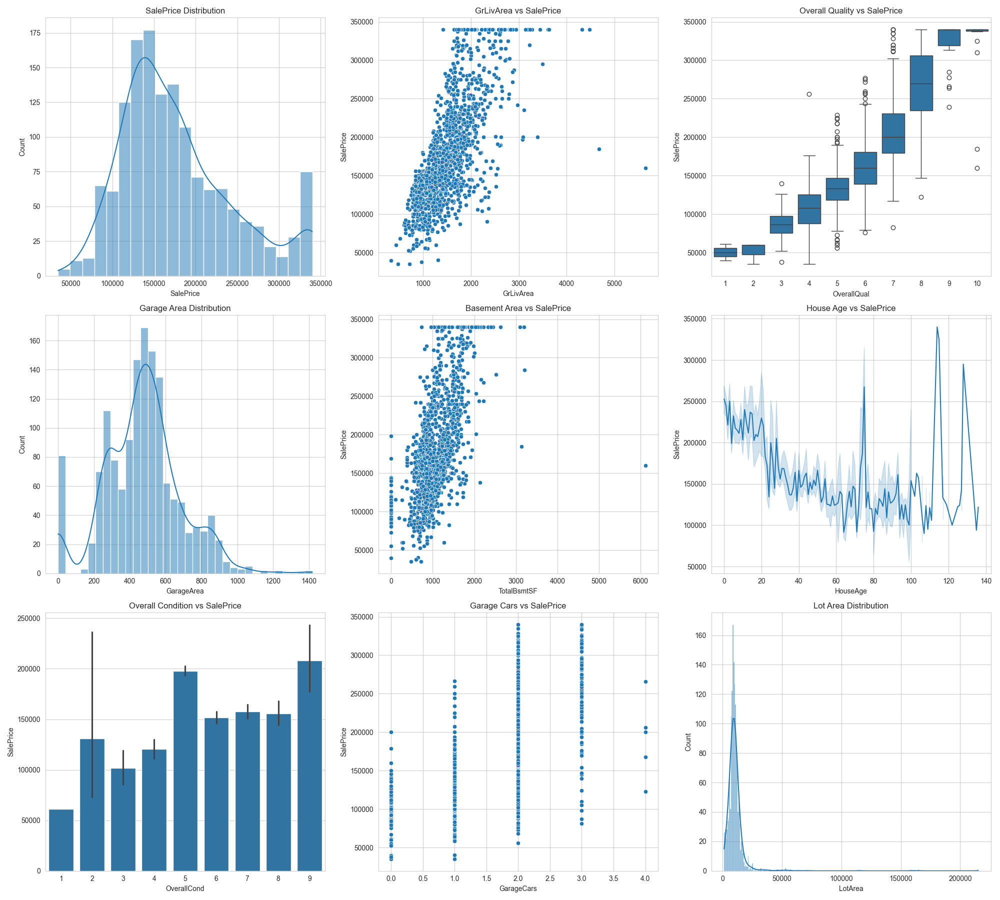

# AI/ML Internship — Week 3

## Author
Mirza Qasim

## Project Title
House Prices — Advanced Feature Engineering & EDA

---

## Dataset
House Prices Dataset (train.csv)

This dataset contains detailed information about residential homes, including property size, quality, location features, garage details, basement information, and sale prices.

---

## Objectives
- Perform advanced data preprocessing
- Handle missing values and outliers
- Engineer meaningful features
- Apply feature scaling and skewness treatment
- Perform exploratory data analysis (EDA)
- Analyze feature importance
- Build professional visualizations and dashboards

---

## Key Tasks Performed

### 🔹 Data Cleaning
- Handled missing values using median and mode imputation
- Performed outlier treatment using IQR method

### 🔹 Feature Engineering
Created new features including:
- TotalBathrooms
- HouseAge
- RemodelAge
- TotalPorchSF
- TotalLivingArea
- HasGarage
- HasBasement
- TotalOutdoorArea

### 🔹 Encoding & Scaling
- Applied Label Encoding to categorical variables
- Used StandardScaler for feature scaling
- Treated skewed distributions using log transformation

### 🔹 Exploratory Data Analysis
- Correlation analysis
- Feature importance analysis
- Histograms
- Scatter plots
- Box plots
- Heatmaps
- Dashboard visualization

---

## Key Insights
- Overall house quality strongly affects SalePrice
- Larger living areas generally increase house prices
- Garage capacity and basement area are important predictors
- Feature engineering improved dataset quality significantly

---

## Dashboard

### Advanced Visualization Dashboard

---

## Files Included
- house_prices_analysis.ipynb
- house_prices_processed.csv
- advanced_dashboard.png
- README.md

---

## Tools & Libraries
- Python
- Pandas
- NumPy
- Matplotlib
- Seaborn
- Scikit-learn

---

## Conclusion
This project demonstrates the importance of feature engineering and preprocessing in real-world machine learning workflows. Proper data preparation and visualization play a critical role in extracting meaningful insights from housing datasets.
